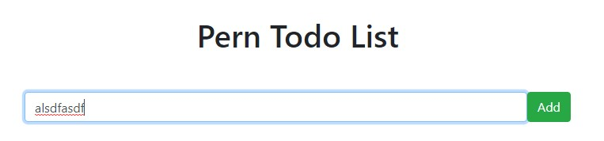
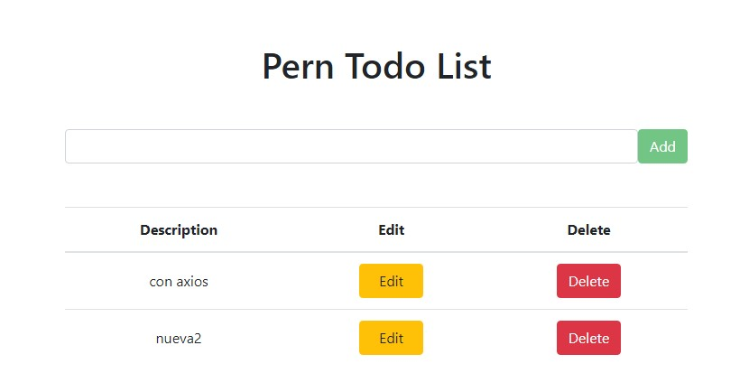
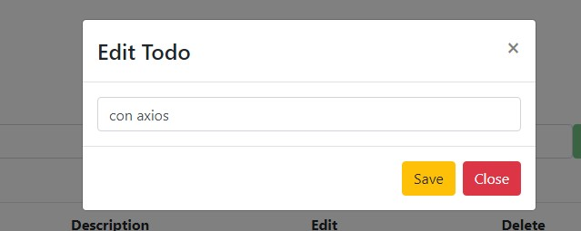

### Todo Web App Full Stack PERN (PostgreSQL Express React Node)

Este repositorio es sólo el **frontend** del proyecto, el backend lo encontrarás aquí:  
[https://github.com/gabyballester/todoapp-api-node-postgresql](https://github.com/gabyballester/todoapp-api-node-postgresql)
***
#### Sobre el proyecto
- Servicio de llamadas a la api usando axios para el CRUD de "to-dos"
- Componente ListTodos para sacar listado de "to-todos"
- Componente InputTodo para crear todos (botón deshabilitado si campo vacío)
- Componente EditTodo que abre un modal para la edición de un "to-do"
- Async/Await
***
#### Instalar dependencias
`yarn install`
#### Arranque del proyecto
`yarn start`

El proyecto se abrirá en la url http://localhost:3000/

#### Capturas del proyecto📷

